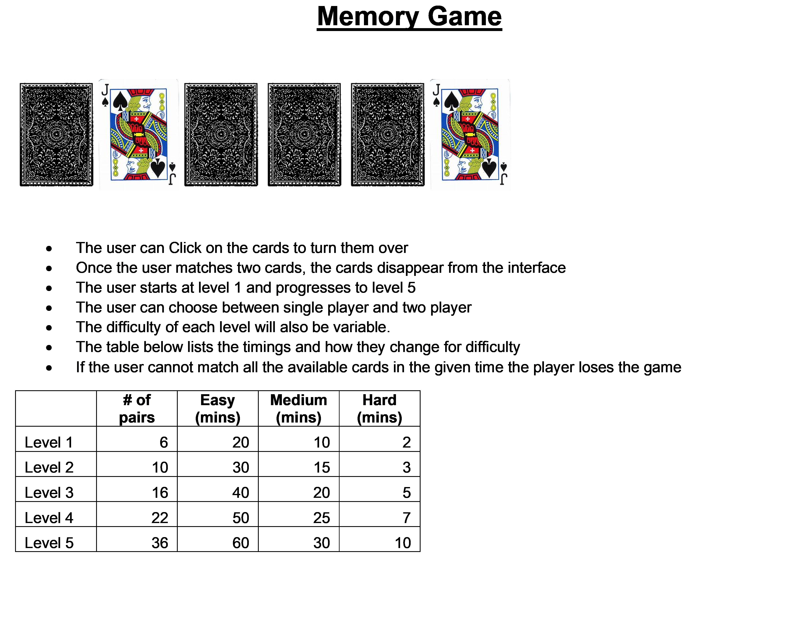

<h1>Wire Frame</h1>

<h1> seir_project1_memory_game_Final</h1>	
<h2>Memory Game Repo</h2>
<ul>	
<li>The memory game created is a simple memory game.</li>	
<li>You click on a card, the card flips. </li>	
<li>Once you make a match the cards stay open</li>
<li>on selecting a wrong match all the matched cards also close</li>
<li>Once the user loads the game, the 'HUD' is displayed.</li>
<li>'Start Game' should be clicked to start the game</li>
<li>The objective is to complete the level as quickly as possible in as few clicks as possible</li>
<li>Once you complete level 1, you can play level 2 or level 3</li>
<li> Level One, Two, and Three have 8, 24, and 48 cards respectively</li>
